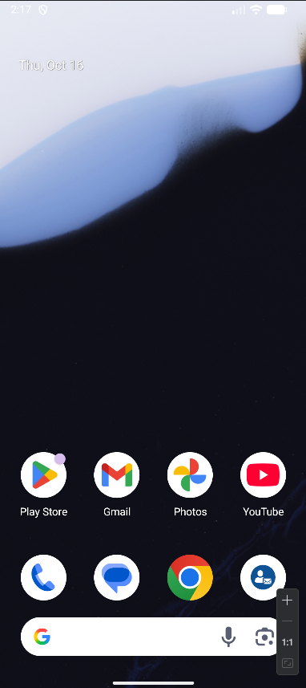
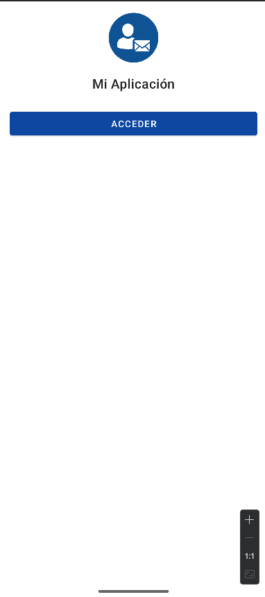
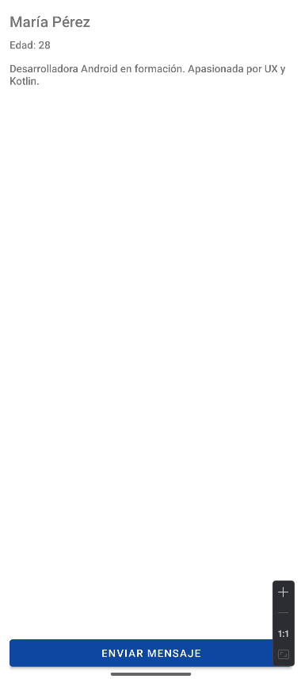
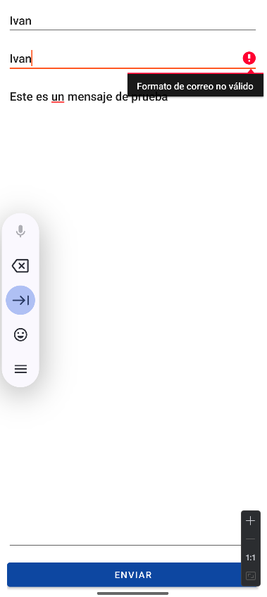
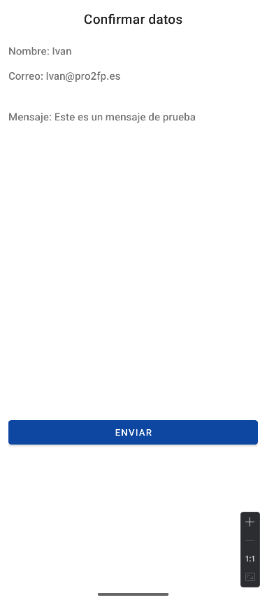

# Aplicación Android con Kotlin – Proyecto de Perfil y Contacto

Aplicación Android nativa desarrollada en **Kotlin** con **layouts XML**. Este proyecto educativo muestra la implementación de navegación entre Activities, validación de formularios y el uso de estilos personalizados mediante recursos XML.

---

## 🧩 Descripción general

La aplicación consta de tres pantallas principales:

1. **MainActivity:** pantalla inicial con logo y botón de acceso.  
2. **PresentationActivity:** muestra información personal ficticia (nombre, edad, descripción).  
3. **FormActivity:** formulario de contacto con validaciones.  
4. **ConfirmationActivity:** presentación de los datos enviados.

Se utilizan **Intents explícitos**, **paso de datos entre Activities** y **ConstraintLayout** en todos los layouts.

---

## ⚙️ Características principales

- **Diseño moderno:** Uso de ConstraintLayout en todas las pantallas.  
- **Validación de datos:** verifica campos vacíos y formato de email.  
- **Persistencia ligera:** guarda datos de confirmación en SharedPreferences.  
- **Personalización:** colores y fuentes en *styles.xml* y *themes.xml*.  
- **Ícono de aplicación y logo en portada.**  
---

## 🧠 Tecnologías utilizadas

- **Kotlin** – Lenguaje principal.  
- **Android SDK 34+**  
- **ConstraintLayout** – Diseño responsivo.  
- **View Binding** – Acceso a vistas seguro y moderno.  
- **Material Components** – Estilo visual basado en Material Design.  

---

## ✅ Validaciones implementadas

- El nombre, correo y mensaje **no pueden estar vacíos**.  
- El correo electrónico debe cumplir el formato válido (`@` y dominio).  
- En caso de error, se muestra un **Toast** con el mensaje descriptivo.  
- En éxito, los datos se pasan a la pantalla de confirmación y se almacenan.  

---

##  Capturas 

- **Pantalla home:** Pantalla para acceder a la aplicación a través del logo

- **Pantalla inicial:** logo y botón “Acceder”.

- **Pantalla de presentación:** muestra datos simulados.

- **Pantalla del formulario:** validaciones activas.

- **Pantalla de confirmación:** visualización final de los datos.
